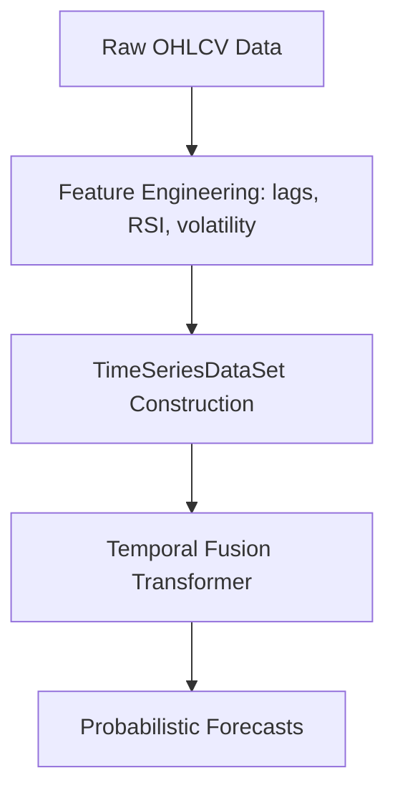

# ForecastTest: Temporal Fusion Transformer for Cryptocurrency Forecasting

## Usage (single entrypoint)

```bash
# Run the full pipeline end-to-end
./exec.sh --full   --symbols "BTCUSDT ETHUSDT"   --interval 1m   --days 3   --lookback 168   --horizon 24   --epochs 15   --batch-size 64   --device cpu
```

### Stage-by-stage

#### 1) Fetch raw data
Downloads OHLCV for the given symbols/interval.
```bash
./exec.sh --fetch   --symbols "BTCUSDT ETHUSDT"   --interval 1m   --days 3
```
Artifacts:
- `data/raw/` — raw CSV files

#### 2) Build features
Constructs the feature set (lags, RSI/volatility, calendar, etc.).
```bash
./exec.sh --features   --interval 1m
```
Artifacts:
- `data/processed/merged.parquet` — feature dataset

#### 3) Train model (TFT)
```bash
./exec.sh --train   --lookback 168   --horizon 24   --epochs 15   --batch-size 64   --device cpu
```
Artifacts:
- `artifacts/*.ckpt` — best model checkpoint(s)  
- `artifacts/qualitative_forecast.png` — forecast plot

#### 4) Evaluate model (rolling-origin)
```bash
./exec.sh --eval   --lookback 168   --horizon 24   --folds 3   --batch-size 64   --device cpu   --checkpoint artifacts/tft-epoch=11-val_loss=4.5663.ckpt
```
Artifacts:
- `artifacts/evaluation.csv` — metrics table  
- `artifacts/eval_mape_rmse.{pdf,png}` — fold metrics plots  
- `artifacts/eval_improvement.{pdf,png}` — TFT vs. naive improvements

#### 5) Plot evaluation
```bash
./exec.sh --plots   --timefmt "%Y-%m-%d %H:%M"
```
Artifacts:
- `artifacts/qualitative_forecast.png`  
- `artifacts/eval_*.{png,pdf}`

### Live “Mock Consensus” (autonomous test)

#### A) Make a live decision now
Uses recent 1-minute data, forecasts the next 60 minutes (EWMA+drift fallback, optional TFT hook), and decides whether to **BUY** with $100 or **HOLD**, accounting for $2 per side commission.
```bash
./exec.sh --consensus-live   --cons-symbol BTCUSDT   --cons-horizon-m 60   --cons-cash 100   --cons-comm 2   --cons-edge 0.5
# Optional: plug in your TFT pipeline
# --tft-hook-cmd "python scripts/exec.py --full --symbols BTCUSDT --interval 1m --days 3 --lookback 168 --horizon 60 --epochs 10 --batch-size 64 --device cpu"
```
Artifacts:
- `artifacts/mock_trade.json` — full decision + config + forecast slice  
- `artifacts/forecast_path.csv` — minute-by-minute forecast path

#### B) Evaluate realized PnL (after the horizon)
Pulls actual candles, simulates conservative fills (close of entry and close of exit), and computes realized PnL.
```bash
./exec.sh --consensus-eval
```
Artifacts:
- `artifacts/mock_eval.json` — realized PnL, return %, commissions, partial flag

#### C) Publication-ready plot (forecast vs. actuals + PnL)
```bash
./exec.sh --consensus-plot --cons-pad-min 10
```
Artifacts:
- `artifacts/consensus_plot.png`  
- `artifacts/consensus_plot.pdf`

---

## Introduction

Forecasting financial time series is challenging due to volatility, noise, and structural breaks. Traditional methods (ARIMA/ETS) often underperform on nonlinear and regime-shifting data. Deep sequence models improve this; the **Temporal Fusion Transformer (TFT)** combines:

- **LSTM encoders/decoders** for local temporal structure  
- **Multi-head attention** for long-range dependencies  
- **Variable Selection Networks (VSNs)** for dynamic feature relevance  
- **Quantile outputs** for uncertainty estimation

This architecture is well-suited to cryptocurrency data with multiple covariates and shifting regimes.

## Forecasting Mechanics

1. **Time Indexing**  
   A monotonically increasing `time_idx` derived from timestamps.

2. **Encoder–Decoder Windowing**  
   Lookback `L` and horizon `H`: the model encodes the last `L` steps to predict the next `H`.

3. **Variable Selection Networks**  
   Per-time-step feature weighting to focus on relevant signals.

4. **LSTM Layers**  
   Capture short-term sequential dynamics.

5. **Attention**  
   Learn long-range interactions over the lookback.

6. **Quantile Forecasting**  
   Predicts multiple quantiles (e.g., 0.1/0.5/0.9) to represent uncertainty.

## Toy Mathematical Example

\[
y_t = 0.5\,y_{t-1} + \sin(\mathrm{dow}_t) + \epsilon_t,\quad \epsilon_t \sim \mathcal{N}(0,1)
\]

- \(y_{t-1}\): autoregression  
- \(\mathrm{dow}_t\): cyclical calendar effect  
- \(\epsilon_t\): noise

TFT learns short-term AR behavior, longer periodic effects, and outputs quantiles for risk bands.

## Pipeline Overview



## Scripts

- `scripts/setup_data.py` — Fetch raw OHLCV data  
- `scripts/make_features.py` — Build features (lags, RSI/volatility, calendar)  
- `scripts/train_tft.py` — Train TFT and save checkpoints/plots  
- `scripts/evaluate.py` — Rolling-origin evaluation and metrics  
- `scripts/consensus_live.py` — Live decision (mock $100, $2 per side commission)  
- `scripts/evaluate_pnl.py` — Realized PnL evaluation for the live decision  
- `scripts/plot_consensus.py` — Publication-ready plot of forecast vs. actuals + PnL  
- `exec.sh` — **Single entrypoint** to run all stages above

## Artifacts

- **Models:** `artifacts/*.ckpt`  
- **Forecast plots:** `artifacts/qualitative_forecast.png`, `artifacts/consensus_plot.{png,pdf}`  
- **Metrics:** `artifacts/evaluation.csv`, `artifacts/mock_eval.json`  
- **Consensus:** `artifacts/mock_trade.json`, `artifacts/forecast_path.csv`  
- **Data:** `data/raw/`, `data/processed/merged.parquet`

## Results

- **Forecast Plot:** qualitative forecast over held-out segments  
- **Evaluation Plots:** MAPE/RMSE per fold, improvements vs. naive baselines  
- **Consensus Plot:** actuals vs. forecast path, entry/exit markers, realized PnL box

## Conclusion

This project demonstrates a complete, reproducible TFT workflow for crypto forecasting, plus a lightweight “mock consensus” layer for autonomous decision-making and transparent evaluation suitable for reports.

### Future Work

- Real-time/streaming inference  
- Additional exogenous features (order-book, sentiment/news)  
- Multi-resolution forecasting (1m, 5m, 1h) and hierarchical reconciliation
